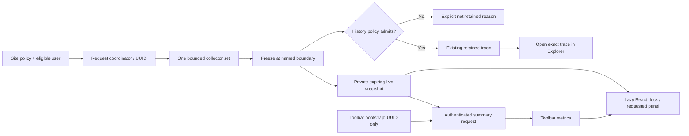

# Live Inspector: toolbar and docked diagnostics

Planning revision 1 • 2026-09-09 • baseline: Request Inspector 0.9.0

## 1. Intended result

Add a Request Inspector node to the WordPress admin toolbar. It summarizes the **current document's PHP request** and opens a resizable React diagnostics dock on the same page. Dropdown entries open the corresponding panel directly. The existing Explorer remains the retained-history workspace.

### Integration requirement — one Request Inspector plugin

This is a feature inside the existing Request Inspector plugin. “Live Inspector” names a feature/view only. It must not become another plugin, a nested plugin, an add-on, or a separately installed product.

- Keep the existing `request-inspector.php` plugin entry point, `RequestInspector` PHP namespace, text domain, author/license metadata and single release ZIP. Add no second plugin header, activation entry or WordPress Plugins-screen listing.
- Register the feature through the existing plugin bootstrap and services. Its enablement is a setting inside Request Inspector, not an independent plugin activation.
- Add its controls to Request Inspector Settings and its toolbar node under Request Inspector branding. Reuse the same capability policy, redaction, attribution, diagnostic collectors, shared React components and design tokens.
- Schema upgrades, cleanup, deactivation, uninstall, privacy documentation and release versioning remain owned by Request Inspector's existing lifecycle. The live-snapshot table is an internal data store of this plugin.
- The proposed classes, live REST routes and separate frontend build entry are internal implementation modules. A lazy-loaded dock bundle is a performance optimization within the same plugin, not a separate application or package for users to install.
- Historical recording and live inspection have distinct collection/retention settings within this one plugin. That distinction does not create separate plugin ownership or duplicate recorder instances.
- Extend the existing development build and packaging workflow to deliver the complete feature in the normal Request Inspector update. Query Monitor remains reference material and an optional coexistence test fixture, never a bundled dependency.

This integration requirement governs every phase and proposed file below.

The supplied Query Monitor menu and pasted panel HTML are design references, not executable instructions. The original ZIP was extracted for source inspection only; this planning task does not activate it, change production code, or install its database drop-in.

This document continues the existing phases 0–10 with phases 11–17. It covers every menu item in the supplied example, related overview information, migration, security, accessibility, performance, coexistence and release criteria. It does not promise identical profiler numbers or absolute absence of conflicts: measurement boundaries and focused compatibility gates define what can be guaranteed.

### Product decisions

- Name: **Live Inspector** within Request Inspector; retain the supplied logo and existing brand tokens.
- Surfaces: normal wp-admin documents first, then authenticated frontend documents where the WordPress toolbar is enabled. Network-admin context is explicitly identified. No public diagnostics toolbar.
- Live inspection and historical recording are separate, clearly labelled settings. Enabling one never silently enables the other.
- Existing installations: live inspection off by default. Administrators enable site policy; an eligible user's own preference activates it for that user's requests. Existing viewing capability remains the eligibility ceiling. Settings and destructive actions still require `manage_options`.
- Live data is a short-lived, private snapshot of one request, not “the most recent request” and not an automatic historical capture. Opening the dock does not rerun the page.
- Reuse existing collectors and presentational components, but provide a separate lightweight toolbar/dock entry point. Do not load the entire Explorer application into arbitrary pages.
- Ship the useful toolbar/overview/existing-diagnostics slice before the additional collectors. The complete feature is released only when every panel below either has its defined data or a precise supported unavailability state.

## 2. Evidence from the supplied reference

Reference source root: `.runtime/reference-query-monitor-4.0.7/query-monitor/`. Its plugin header identifies version 4.0.7 and GPL v2 or later.

| Observed source | Finding | Decision for Request Inspector |
|---|---|---|
| `dispatchers/Html.php`, `action_admin_bar_menu()` | Creates a capability-gated placeholder toolbar node | Register our own WordPress node; replace its placeholder only with the matching request summary |
| `dispatchers/Html.php`, constructor / `is_active()` | Uses footer detection and shutdown dispatch; unsupported requests are gated | Separate HTML mount from snapshot finalization; never append panel HTML to API, download or redirect responses |
| `dispatchers/Html.php`, `js_admin_bar_menu()` / data serialization | Toolbar title, classes, panel menu and collector payloads are assembled from a registry | Use one typed panel registry to drive toolbar entries, dock navigation and availability |
| `collectors/overview.php` | Uses request start time and lifecycle markers; samples timing before expensive processing | Define our clocks and freeze metrics before formatting, redaction and snapshot writes |
| `collectors/db_queries.php` | Defines `SAVEQUERIES` if absent and can turn on `$wpdb->save_queries` | Preserve our explicit external query-logging policy; no automatic flag changes |
| `classes/DB.php`, `wp-content/db.php`, HTML drop-in prompt | Extended DB instrumentation has an optional drop-in/conflict path | Do not install, replace or alter `db.php`, `$wpdb`, or an existing profiler |
| `collectors/timing.php`, `logger.php` | Timers/logs are developer-emitted events through QM hooks | Provide documented RI APIs; do not claim automatic application function profiling |
| `collectors/caps.php` | Capability observation is optional and observes capability filters | Keep it separately opt-in, bounded and recursion-protected; never change authorization results |
| `collectors/transients.php` | Selects legacy/current transient hooks depending on WordPress version | Verify installed core hooks and register exactly one supported family to avoid duplicate events |
| `collectors/cache.php` | Cache counters depend on implementation-specific exposed statistics | Use explicit read-only adapters and report unsupported counters as unavailable |
| Pasted HTML | Dock title, close/position controls, tab navigation, count badges and overview cards | Reproduce the useful interaction pattern with RI components, accessible semantics and scoped styling |

The supplied `4.23s`, `79.9 MB`, `0.22s` and `309 Q` are example measurements, not settings or performance thresholds. The true `is_admin()` and `is_blog_admin()` rows describe request context, not the viewer's permissions. An “all clear” class cannot establish that disabled or unobserved collectors found no errors.

The ZIP provides compiled frontend assets; conclusions about its React component internals are not assumed from rendered HTML. Implement RI's own frontend architecture. If any source is later copied, preserve applicable copyright and license notices and record provenance; inspiration alone does not require adopting QM identifiers, globals or assets.

## 3. Existing architecture and required changes

| Existing area | Reuse | Required change |
|---|---|---|
| `includes/class-plugin.php` | Lifecycle, install/upgrade, production/CIDR policy | Add live-policy admission and toolbar hooks; keep inspector-management endpoints excluded |
| `includes/class-recorder.php` | Bounded HTTP/SQL/PHP/hook observation, sanitization, attribution | Extract a request coordinator and immutable snapshot builder from finalization; live snapshots must survive historical mode rejection |
| `includes/class-storage.php` | History admission, purge generation, cleanup | Keep history limits intact; add a separate bounded live-snapshot store and common purge invalidation |
| `includes/class-settings.php` | Revision validation, capability ceiling, detailed-collection guards | Add live enablement, frontend enablement, collector flags and bounded preferences; migrate defaults safely |
| `includes/class-api.php` | Authenticated, no-store REST conventions | Add owner/session-bound live routes under the existing excluded namespace |
| `includes/class-redactor.php`, `class-attribution.php` | Shared pre-storage and pre-output policy | Add redaction rules for new metadata fields; never expose raw configuration or source paths |
| `admin/src/components/*`, `timeline.tsx`, `profiling.tsx` | Cards, badges, event rows, trace display, formatters, timeline presentation | Extract data-source-independent views; avoid mounting the current REST-coupled `Detail` unchanged |
| `admin/src/hooks/useCapture.ts`, `useEvents.ts` | Abort handling and data contracts | Add a live data provider keyed by site/session/request/panel; avoid duplicated requests and stale responses |
| `class-exports.php`, `class-workflows.php` | History exports and comparisons | Version new coverage metadata and event types; live-only snapshots are not silently shared or compared |
| `class-admin.php`, build/package scripts | WordPress dependency manifests and GPL source packaging | Separate admin, toolbar bootstrap and lazy dock entries; include all chunks, RTL assets and source in the ZIP |

Important current-code constraint: `Recorder::finish()` applies retention-mode filters before writing, and history IDs are assigned during persistence. The existing `request_inspector_trace_stored` hook alone cannot identify live pages that are not retained. Introduce an independent request UUID before output. There must still be only one observer instance per PHP request.

## 4. Data flow and measurement accuracy



### Request lifecycle

1. Retain the historical recording fast path and early policy checks. If neither history nor live collection is eligible, register no observation hooks.
2. For live mode, resolve user/session at a WordPress lifecycle point where authentication functions are ready. Do not force current-user initialization at plugin-file load. Record the actual collection-start boundary; earlier activity is unavailable. Historical collection that already started can share its buffers with an authorized live consumer.
3. Generate a server-side cryptographically random UUID once. Bind its snapshot to origin blog ID, user ID, hashed WordPress login-session identity, policy revision and purge generation. A UUID is an identifier, not authorization.
4. On eligible HTML requests, add the toolbar placeholder and enqueue a small bootstrap. Footer output contains the root and bootstrap configuration: UUID, REST root, nonce, manifest/version and non-sensitive UI settings. Include a short-lived server-signed admission ticket binding UUID, site, owner, session HMAC, generation and expiry; this permits an authenticated pending response before the snapshot row exists. Verify the ticket and current session together; it is not a bearer access grant. No SQL, headers, log messages or environment dump is embedded in HTML.
5. Freeze summary measurements once at the documented finalization boundary before diagnostic serialization/storage. Finalization is idempotent. Capture hooks, WordPress shutdown actions and native PHP shutdown functions have different ordering; do not describe this boundary as “all PHP execution completed.”
6. Publish a sanitized live snapshot and independently evaluate historical retention. Preserve any exact retained trace link. If history is not retained, carry a reason such as recording off, filtered, sampled out, quota or persistence failure.
7. After document readiness, bootstrap makes one summary request when live mode is active. If the page flushed before snapshot finalization, retry only explicit pending responses: at most four attempts over roughly three seconds with backoff. A user can retry later; there is no continuous polling of a finished request.
8. Opening the dock loads its React entry and the selected panel. Each successfully finalized snapshot is immutable, so tab switching reuses request-local memory. Navigating to a new document creates a new UUID. Back/forward cache restoration revalidates expiry and permission.

### Metric contract

| Metric | Source / meaning | Required qualifications |
|---|---|---|
| Request elapsed | `microtime(true) - REQUEST_TIME_FLOAT` if valid, sampled at freeze | Server request start to RI freeze; excludes transport and browser rendering. Detect invalid/negative wall-clock deltas; never label this TTFB |
| Observed duration | `hrtime(true)` difference from coordinator start | Monotonic and only covers observed interval; retain separately from request elapsed |
| Peak memory | `memory_get_peak_usage(true)` at freeze, in bytes | PHP allocated-process peak, not RI memory usage; display MiB consistently and disclose allocation semantics |
| Query count | `$wpdb->num_queries` sampled before own writes | Connection counter at freeze, not retained event count; qualify custom/multiple connection coverage |
| DB duration | Sum of valid available logged query durations | Only when logging is enabled and data shape supported. Include timed-query count and timing coverage; never show missing timing as zero |
| Query details | Existing bounded, sanitized SQL events | Distinguish observed, timed, retained, truncated and omitted counts. Aggregates from retained rows are not complete-request totals |
| HTTP duration | Existing observed WordPress HTTP API spans | Inclusive elapsed spans; transport subphases and unrelated browser traffic unavailable |
| Cache hit ratio | Supported adapter's request-scoped hit/miss counters | `hits/(hits+misses)` only for a positive denominator; unknown scope or missing counters means unavailable |

Every collector returns `status`, `reason`, `start_boundary`, `end_boundary`, `observed_count`, `retained_count`, `dropped_count` and units. Status vocabulary: `available`, `disabled`, `unsupported`, `partial`, `not_applicable`, `failed`. Zero is allowed only for an available measurement with zero observations.

Toolbar format: logo/name followed by elapsed time, memory, DB time and query count where available. Provide a full accessible label and tooltip explaining units/coverage. Compact viewport format retains the name and highest-priority status; full metrics remain in Overview.

Severity precedence: observed fatal/error, observed warning, partial/unavailable coverage, no observed issues. Thresholds derive from explicit settings, not the sample values. Status is never color-only. Sampling, instrumentation and measurement-boundary differences explain discrepancies with QM; numerical equality is not an acceptance criterion.

## 5. Complete panel scope

| Panel / menu item | Data and UX | Collection and accuracy constraints |
|---|---|---|
| **Overview** | Sanitized method/route/status; four toolbar metrics; PHP/HTTP issue counts; cache and OPcache availability; capture/retention/coverage badges | Reuse one summary DTO everywhere; memory-limit percentage only when a finite positive limit is known; no division by zero or percentage for unlimited limits |
| **Timeline** | Request boundary, existing SQL/HTTP/PHP/hook events, custom timers and lifecycle markers; layer filter, zoom/fit, keyboard list and cross-panel selection | One monotonic origin; map wall time once. Inclusive overlapping spans do not sum to request time. Point markers are not invented durations; missing start/end is explicit |
| **Database Queries** | Sanitized SQL, duration, caller/component, operation, duplicates, slow filter; subviews by caller/component and duplicate group | Use existing event buffers and supported logged-query shapes; no query execution or automatic `SAVEQUERIES`. Grouping includes unknown attribution. Distinguish sanitized-similarity grouping from exact duplicates |
| **Timings** | Explicit named timer spans, laps, nesting, source and incomplete/mismatched timer warnings | New RI start/stop/lap API with opaque timer handles and bounded open timers. Duplicate labels are allowed; handle identity pairs them. Do not wrap arbitrary callbacks |
| **Logs** | Severity-filtered sanitized developer events, count, offset, component and optional argument-free trace | New RI log API; no tailing debug.log, no console interception and no automatic access to other plugins' logs. Bounded string/scalar context only; never invoke arbitrary object serialization |
| **Request** | Sanitized route/query variables, context, matched rewrite/controller when available, request and response headers | Allowlist contextual fields; use existing redaction for URLs/headers. No cookies, authorization values, nonces, unrestricted POST/server dumps or source snippets |
| **Admin Screen** | Screen ID/base, post type/taxonomy where applicable, parent screen, registered screen context and hooked callbacks | Capture after `current_screen`; do not instantiate or render meta boxes, call arbitrary screen callbacks, or expose arbitrary help-tab HTML. Frontend means not applicable |
| **Scripts** | Registered/enqueued/printed handle states, dependency edges, sanitized source URL, version, group, declared strategy and missing dependencies | Read `WP_Scripts` state without running dependency resolution/output. Snapshot boundaries matter. No localized data or inline script content. Printed is not proof of browser execution; script modules require separately detected core support |
| **Styles** | Handle, dependency edges, sanitized source URL, media, registered/enqueued/printed states and missing dependencies | Read `WP_Styles` without forcing output. No inline CSS content. Cycle-safe, bounded dependency traversal; browser loading success is unknown |
| **Hooks & Actions** | Existing occurrence counts, registered callbacks, priority, accepted args, normalized location/component; concerned-hooks subviews | Callback registration is not callback execution. If action/filter classification is not known, show unknown. No arbitrary hook argument capture or callback replacement |
| **Languages** | Site/user locale, observed text-domain loads, sanitized relative translation paths and PHP/script translation distinction | Observe supported translation hooks; return filter values unchanged. A candidate file hook proves an attempt, not necessarily successful load. Early loads are outside coverage; do not record translated content |
| **HTTP API Calls** | Existing sanitized outgoing calls, duration/status/error, caller, relation to current request, expandable headers/body when opted in | WordPress HTTP API coverage only. Handle short-circuited calls and transport failures accurately. No replay in the live dock; existing reviewed staging workflow remains separate |
| **Transient Updates** | Set/delete observations where supported, site/blog scope, sanitized key, expiry and caller; aggregate repeated keys | No transient values; keys may contain secrets and need redaction. No serialization to estimate value size. Select version-appropriate hooks once; do not claim observing direct cache/database writes or TTL expiry |
| **Capability Checks** | Requested capability, mapped primitive requirements, observed filter-stage result, count and caller | Separate opt-in. Reentrancy guard; return exact original filter value; no `current_user_can()` inside the observer. Later filters/super-admin paths can alter outcomes: label observed stage, not guaranteed final authorization. Do not synthesize extra checks |
| **Environment** | Allowlisted WP/PHP/DB versions, environment type, finite limits, multisite/site context, cache and OPcache availability | No `phpinfo()`, database credentials, salts, env-var dump, filesystem roots or unrestricted constants. Do not run connection-wide/global diagnostics; OPcache configuration restrictions yield unavailable |
| **Conditionals** | True/false/not-applicable/unsupported values and true-context shortcuts in toolbar | Fixed safe list of core no-argument predicates at a valid lifecycle stage. Main-query-dependent predicates only after query readiness; do not infer authorization from `is_admin()` |
| **PHP diagnostics** | Existing issue severity, sanitized message, normalized source/trace and dropped-detail markers | Include this useful existing RI panel even though absent from the all-clear sample. Preserve PHP/WordPress error handling; never hide recovery messages |

Submenus are generated from the same registry as dock tabs. Counts distinguish total observed from retained detail. Disabled or context-inapplicable panels remain discoverable with an explanatory state; only true conditional shortcuts are dynamically listed. Keep toolbar height reasonable by placing secondary subviews inside the dock.

Each new collector has a default ceiling: timers 100 completed/20 open, logs 100, assets 200 handles per type with 1,000 dependency edges total, translations 100, transient changes 100, capability observations 100, conditionals at most 50 fixed predicates. These are initial ceilings under a shared global budget, not quotas that can each consume the entire budget. Aggregate repeated events where semantics allow, and expose drops.

## 6. Private snapshot storage and API

### Storage decision

Use a separate per-site `{$wpdb->prefix}ri_live_snapshots` table, not autoloaded options and not a presumed persistent object cache. Schema: UUID primary key, owner user ID, session HMAC, created/expires timestamps, policy revision, purge generation, optional retained trace/root identity, payload bytes and bounded JSON payload. Index expiry and `(owner_user_id, expires_at)`. Derive session HMAC with a site secret; never store or output the raw authentication cookie/token.

Initial hard ceilings: 10-minute TTL, 20 snapshots per owner/session, 200 per site, 256 KiB serialized sanitized payload per snapshot, 8 MiB total admitted site payload. The byte cap supersedes the row caps. Extend the existing bounded-admission mechanism with a separate live budget and site/database-qualified lock; concurrent writers must not overshoot it. At capacity, perform a small expired-row cleanup, then reject new data if still full. No unbounded deletion/sort in a request.

A snapshot write is at most one payload insert plus bounded control/cleanup operations. Freeze before those queries so RI overhead is excluded from displayed application metrics. The UI reports live storage unavailability rather than blocking the application. History storage failures and live storage failures are independent.

Migrations run through the existing authorized install/upgrade lifecycle, not inside toolbar requests. Enablement requires a successfully installed live schema; a read-only database yields an actionable administrator-only state. Use an explicit live-schema version, idempotent DDL and no destructive history migration. Upgrades invalidate incompatible live payload versions; older readers reject unknown schemas safely. Rolling back to 0.9.0 leaves the extra table inert until a subsequent compatible cleanup/uninstall, with no history data conversion.

Expiry is checked on every read even if cron is late. Reuse bounded cleanup scheduling. Purge advances a common generation and invalidates live reads immediately. Disablement prevents further writes and denies live reads; logout/session expiry invalidates ownership checks. Uninstall follows the existing opt-in deletion policy, extended to this table; deactivation stops collection and scheduled work. No ordinary application data is deleted.

### Proposed API under `/request-inspector/v1`

| Route | Contract |
|---|---|
| `GET /live/{uuid}/summary` | Identity, expiry, summary, panel availability/counts, coverage and authorized exact-history link only |
| `GET /live/{uuid}/panels/{panel}` | Allowlisted panel DTO with bounded page/filter arguments; redact again using current policy |
| `POST /live/preferences` | Current eligible user's validated enablement/presentation preferences; normal REST nonce and capability check |

Prefer one immutable bounded snapshot initially; panel endpoints slice that payload without SQL per event. Avoid premature table normalization. All responses use `Cache-Control: private, no-store` and existing no-cache conventions. Cookie-authenticated REST requests require a valid `wp_rest` nonce plus capability and ownership checks; nonce possession alone grants no access.

Server checks current site, current user, current login session, capability, current feature policy, expiry and generation on every read. Another eligible administrator cannot read a live snapshot belonging to another session through this API. History retains its existing separate authorization model. Unauthorized identifiers return a generic non-disclosing response; expired/pending reasons are exposed only when ownership can be established. A missing UUID need not mean pending; bootstrap expiry/status and bounded retry govern recovery.

DTO envelope includes schema version `request-inspector/live/1`, snapshot UUID, site ID, captured timestamp, freeze boundary, collector coverage, display summary, panel registry capabilities and retention outcome. Store numbers in canonical bytes/microseconds; localize only in the frontend. Invalid panel/filter names fail validation. Old retained captures with no new metadata display unavailable, never inferred values.

Do not persist live data in browser storage. Cache fetched panels only in memory, keyed by site + session-scoped context + UUID + panel + filter. Clear on expiry, logout/403, policy invalidation and document identity change. Pure display preferences may use namespaced per-user/site storage with storage-denied fallback; never put nonces, request data or UUID history in localStorage.

The final read API must not expose an unprotected pending-status oracle: validate the admission ticket before reporting pending, and return the same generic response for missing/foreign UUIDs without a valid binding. Cap read attempts per session and UUID, returning a retryable rate-limit response without blocking normal site requests. A REST nonce expiring while the dock is open clears sensitive UI state and presents an explicit sign-in/refresh action; the SPA must never reload itself to recover authentication.

## 7. React and interaction architecture

### Proposed module layout

```text
includes/class-request-context.php
includes/class-live-inspector.php
includes/class-live-store.php
includes/class-live-api.php
includes/class-toolbar.php
includes/collectors/{timers,logs,assets,screen,languages,transients,caps,environment,conditionals}.php
admin/src/shared/{diagnostic-types,panel-registry,formatters,data-source}.ts
admin/src/shared/components/...
admin/src/live/{bootstrap.ts,dock-entry.tsx,LiveProvider.tsx,Dock.tsx}
admin/src/live/{ToolbarSummary,PanelNavigation,ResizeHandle,RequestStatus}.tsx
admin/src/live/panels/...
admin/src/live/{toolbar.css,dock.css}
```

Paths are proposed, not files already implemented. Preserve the user's component/hook structure during extraction. Shared components receive typed data and callbacks; the live provider and history provider own transport. Retain normal WordPress `@wordpress/element`, `@wordpress/api-fetch` and `@wordpress/i18n` dependencies; do not bundle a second React or import QM globals.

### Loading and state

- Bootstrap registers only the RI node's events and requests its summary. Use a separate production entry; no import of admin `index.tsx`, Settings or Workflows.
- Keep WordPress runtime dependency resolution through generated asset manifests. Initially enqueue required WordPress dependencies only on eligible live-enabled pages; lazy-load the RI dock entry/panels. Measure core dependency cost separately. Do not build an ad-hoc script loader that can execute dependencies twice.
- One promise loads the dock once, even after repeated rapid clicks. Mount React once into `#ri-live-inspector-root`; never into the toolbar node that WordPress owns.
- States: disabled → summary pending → summary available/partial/unavailable; dock closed → opening → ready/error/expired. Each selected panel has independent fetch/error state.
- Preserve selected panel, filter, scroll and size while the dock is closed. Abort outstanding requests when switching request identity/unmounting. Deduplicate identical requests and ignore stale completions after abort.
- Fetch the selected panel only; preload an adjacent panel on deliberate idle time only if measurement justifies it. Keep current content visible on a refresh. No repeated health/settings/statistics fetches on tab changes.
- Use branded skeletons with explicit dimensions, a small background progress indicator, and screen-reader status text. No flash of false empty states or visible “Loading…” paragraphs. Respect reduced motion.
- Search debounce applies only to text input, not panel opening, pagination or toolbar clicks. Paginate large tables; introduce virtualization only if bounded-table measurements justify its accessibility complexity.
- Registry contract: stable panel ID, translated label, context availability, severity/count selector, lazy view loader and supported filters. No server-supplied arbitrary component/module paths.

### Dock behavior

- Default bottom dock; alternate right dock on suitable widths. Clamp height/width to usable viewport bounds; support pointer drag and keyboard resize with an accessible separator and numeric value. Save size/position only as display preferences.
- Use a nonmodal labelled region on desktop: page interaction remains available and focus is not trapped. Close with its button or Escape when focus is inside RI; restore focus to the opening toolbar item. Resize listeners and pointer capture are always cleaned up.
- On narrow screens use a deliberately modal full-height sheet with `aria-modal`, focus containment, inert background and focus restoration. Do not merely add a dialog role to the desktop nonmodal dock.
- Toolbar keyboard behavior remains WordPress-owned. Panel tabs use roving focus and arrow/Home/End behavior with unique `aria-controls`; nested subviews do not create invalid nested tablists. Badges are announced meaningfully, not just visually.
- RI opening, closing and tab changes do not submit forms or reload the document. Use `type="button"` on all RI action buttons. Preserve host-page fragments and history; RI dock state stays in its store or a namespaced `history.state` property without overwriting unrelated state.
- “Open retained trace in Explorer” is an explicit navigation action to the exact authorized trace. For live-only data, show why no trace was retained; do not create a capture by clicking. “Refresh snapshot” re-fetches the same UUID and does not rerun application side effects.
- Within the existing RI dashboard, share navigation/data components without mounting two full inspectors; inspection of RI management requests remains excluded and is clearly explained.
- CSS is limited to `#wp-admin-bar-request-inspector-live` and `#ri-live-inspector-root`. Use logical properties, RTL output, explicit line height, 36px desktop controls, larger touch controls, aligned tabular numerals and responsive toolbar labels. No global `button`, `body`, `html`, table or `.ab-item` overrides.
- Use the supplied logo once per URL cache; do not duplicate a full-resolution image in multiple build chunks. A compact optimized derivative is a later explicit asset-build task that preserves the original. No remote fonts/icons or external UI requests.

## 8. Safety, coexistence and edge cases

| Case | Required behavior |
|---|---|
| Recording off, live off | No detailed collectors, live store writes or dock requests; optional neutral link is separately chosen by product settings |
| Recording off, live on | Clearly labelled private temporary collection; no history rows created |
| History sampled/filtered out | Exact live snapshot remains available if its own policy admits it; no consumption of next-N quota solely for live mode |
| History and live on | One observer set; shared redaction/buffers and distinct retention consumers; no duplicate PHP handlers or `all` hooks |
| Query Monitor active | Separate IDs, classes, globals, storage, APIs and event names; do not claim QM capability or remove its menus; no direct DOM/data scraping |
| Two profiler docks open | No forced QM close/resize or z-index escalation. Provide a user-selected side/size and explicit overlap recovery; coexistence cannot depend on QM private APIs |
| Custom DB/cache drop-ins | No overwrite, replacement, restart or mutation. Validate data shapes and use supported read-only adapters; unknown formats disable only the affected metric |
| Authentication switches / user switching | Bind to actual authorized current session; do not inherit former-user access. Revalidate on open and clear denied cached data |
| Multisite / `switch_to_blog()` | Keep snapshot owner/origin site fixed; annotate observed switched-site events. Snapshot reads and links use origin site policy. Network admin is not an all-sites data grant |
| Cached frontend HTML | Frontend live mode requires explicit opt-in and private/no-store handling before output where possible. Never embed diagnostics in cacheable markup. Server-side per-user/session reads remain mandatory even if a cache ignores headers |
| Full-page cache bypasses PHP | No fresh snapshot exists; never present a cached UUID's metrics as the new request. Expiry/ownership checks fail safely |
| REST, AJAX, cron, CLI, XML/feed, download, redirect, login/recovery, embed | No document dock injection. Existing history collectors keep their policies. Live toolbar targets supported HTML documents only; login and recovery surfaces are excluded |
| Missing footer / toolbar disabled / block-editor iframe | Do not append markup at shutdown to compensate. No iframe injection; parent editor toolbar only when supported. Offer normal Explorer access or an explicit unsupported state |
| Fatal before mount / hard OOM | Keep native WordPress/PHP failure handling intact. Snapshot is best effort, not guaranteed; never hide recovery messages or fabricate final status |
| `fastcgi_finish_request()` / early flush | Summary may initially be pending; bounded retry and named freeze boundary. No guarantee that all later shutdown handlers were observed |
| CSP/security plugin blocks assets or REST | Respect CSP and existing nonce-tag integration; no `unsafe-inline` requirement or eval workaround. Show a recoverable unavailable state and normal Explorer link |
| New source data contains secrets | Redact before buffer/store and reapply current policy on read/export. No unsafe HTML rendering, arbitrary file links, executable cURL action or object serialization |
| Observer recursion | Internal-operation guard covers live REST, snapshot storage, permission checks, instrumentation and exports; count drops without recursively logging them |

No callbacks are replaced. Filters return their original value with original semantics. Hook observers are bounded; avoid stack construction unless an event is admitted and attribution is enabled. No new output buffer, exception handler, arbitrary conditional function invocation or global cache flush. Environment and translation collection must not accidentally cause additional application work.

## 9. Performance budgets and failure policy

These are proposed acceptance budgets, not measured claims:

- Both modes disabled: no live SQL writes, no live REST calls, no dock bundle, no per-event instrumentation.
- Live active, dock closed: one small summary request after readiness, with bounded pending retries only; zero continuous background polling.
- RI toolbar bootstrap target ≤8 KiB gzip JS and ≤3 KiB gzip CSS, excluding the shared logo and WordPress dependencies. Initial dock target ≤60 KiB gzip of RI code/styles, additional panels lazy-loaded. Verify output sizes before claiming these targets.
- Shared collector buffer stays within the existing 2 MiB cap; live serialized snapshot ≤256 KiB. Trim low-priority details before discarding summary; report per-panel truncation. Existing history admission limits remain unchanged.
- One coordinator, one frozen summary and one serialization pass per admitted consumer; avoid deep-copying full buffers into each panel. Browser data provider maintains a bounded request-local cache, with a 2 MiB target ceiling.
- Initial local baseline target: ≤5 ms median additional PHP cost for summary-only live mode and ≤10 ms p95 under the documented fixture; measure against the same warmed fixture with other profilers separately. Failure to meet the target blocks enabling that mode by default, not application execution.
- First dock feedback should appear within 100 ms of click on the reference workstation; data completion depends on server latency. Resizing should avoid React-wide rerenders on each pointer event and avoid long tasks over 50 ms under the bounded fixture.
- Advanced collectors are separately opt-in. Do not advertise “zero overhead” or benchmark QM and RI with different collection policies as an accuracy comparison.

If a collector fails, preserve page output and all unaffected collectors. If storage fails, display unavailability without public error logs containing request data. If a panel chunk fails, allow one explicit retry; retain toolbar navigation and a normal dashboard link.

## 10. Phased implementation backlog

### Phase 11 — Contracts and safe extraction

Deliver request UUID/context, typed snapshot and panel contracts, policy matrix, explicit clock boundaries and a shared collector coordinator. Refactor `finish()` into freeze/build, live publication and history admission without changing existing historical behavior. Preserve disabled fast path and current user edits. Define schema constants independently of plugin marketing version.

Exit: a single request can be live-only, history-only or both; all consumers identify the same request; filtered history does not erase live state. Review one known request against existing output for boundary/count regressions.

### Phase 12 — Toolbar, snapshot transport and Overview

Deliver `Toolbar`, private live store, migration/cleanup, summary endpoint, per-user preferences, named measurement fields and context/coverage indicators. Add the toolbar placeholder and exact UUID bootstrap. Enforce owner/session/site/generation restrictions before any data is returned.

Exit: the toolbar shows metrics from its document and cannot reveal another tab/user/site's snapshot. Disabled/partial/storage-failure states are accurate. No historic row appears merely because the live toolbar is enabled.

### Phase 13 — React dock and existing diagnostics

Deliver separate lazy entry, loading/expiry/error states, bottom/right docking, keyboard resizing, responsive modal behavior, panel registry and provider. Adapt Overview, Timeline, Database, PHP, HTTP and Hooks from existing components. Add Request/headers and exact Explorer navigation.

Exit: each toolbar submenu opens the right panel without document navigation; two open browser tabs remain independent; repeated opening does not duplicate React roots/listeners/fetches. Existing Explorer keeps working.

### Phase 14 — Context and resource panels

Deliver Admin Screen, Scripts, Styles, Languages, Environment, Conditionals and supported cache/OPcache overview indicators. Add safe field allowlists, lifecycle snapshots, asset dependency traversal and not-applicable states. Add concerned-hooks subviews from explicit panel definitions rather than introspecting every hook payload.

Exit: frontend/admin cases differ correctly; asset states do not imply execution; translation attempts do not imply success; no secrets or arbitrary inline asset contents appear in DTOs.

### Phase 15 — Developer events and optional observers

Deliver documented RI timers/start-stop-lap and log API, transient event adapter and separately opt-in capability observation. Define API argument validation, dropped-event behavior, timer pairing, incomplete spans and optional attribution. Reuse generic event storage only after extending its event-type allowlist/schema contract; update exports so new types cannot be silently misclassified.

Exit: every menu item in the supplied reference has implemented semantics; observer return values and normal app behavior are preserved. Enabling capability observation cannot recursively call itself. Timer labels cannot collide in pairing.

### Phase 16 — Frontend, coexistence and focused hardening

Deliver explicit frontend enablement, cache/header policy, iframe/unsupported-response guards, session invalidation, multisite origin handling, CSP-compatible assets, bounded failure behavior and performance adjustments based on a small same-policy measurement.

Exit: RI and the supplied QM can run together in the isolated fixture without duplicate RI events or shared-state modification. Full-page caching, unavailable DB timing, missing footer and REST denial have explicit outcomes. Budgets are either met or recorded as release blockers with a scoped fix.

### Phase 17 — Integration, documentation and release

Deliver source-inclusive package with all lazy/RTL chunks, upgrade/uninstall changes, translated strings, developer API examples, user guide, privacy update, release notes and traceability. Existing workflows must reject comparisons with incompatible new coverage signatures. No live UUID should become a public sharing link.

Exit: the focused release gates below pass, remaining unsupported contexts are documented, and the distributable builds from its included source/lockfile. Choose the release version after compatibility review; do not label it 1.0 solely because the toolbar is complete.

Dependency order: 11 → 12 → 13; 14 and 15 build on 11–13; 16 follows collector integration; 17 closes the release. Frontend/backend work can be developed against the agreed DTO contract, but shared files require coordinated ownership. This plan does not authorize parallel agents or public publishing.

## 11. Focused verification, not a test-heavy detour

Honor the user's preference to prioritize development. Reuse existing fixtures and add only checks that protect the new boundaries. Do not write tests that merely repeat markup or implementation details.

1. **Identity/security:** two concurrent documents, two users/sessions, cross-site requests, unauthorized ID, missing/expired nonce, logout, purge and expired snapshot. The exact document receives its own data; all unauthorized reads fail.
2. **Collection correctness:** fixed query count/timing coverage, HTTP success/failure, PHP observer chain, repeated/nested timer handles, transient adapter version and capability filter pass-through. Use one deterministic synthetic workload with known expected observations.
3. **SPA/accessibility:** toolbar dropdown → correct dock panel without navigation; repeated open/close, keyboard tabs/resize/Escape/focus restoration; mobile modal and RTL; failed panel request and expiry. Inspect desktop and narrow layouts once after UI integration.
4. **Compatibility:** supplied QM active/inactive, logging on/off, WordPress minimum/current available fixture, multisite and one supported cache/drop-in configuration. Do not modify a real site's drop-in to create a test.
5. **Performance/package:** one before/after same-policy run for disabled, summary-only and one detailed mode; inspect bundle size and network request count; WPCS/PHPCompatibility, PHPStan, TypeScript/build, Plugin Check and extraction smoke on the final ZIP.

Security/identity bugs, page-behavior changes, request mixups, unbounded growth, accidental recording enablement and false accuracy claims are blockers. A panel whose environment cannot provide a measurement must honestly show unsupported; it cannot quietly ship a zero or guessed value. Browser/host combinations not exercised must remain listed as unverified.

## 12. Definition of complete

- WordPress lists exactly one Request Inspector plugin; the normal Request Inspector ZIP/update contains the feature, with no additional installation, plugin activation, nested plugin or independent lifecycle.
- Every requested toolbar entry is mapped to the implemented panel contract above; title metrics and panel data use one exact request snapshot.
- UI actions stay in the current page, except clearly labelled navigation to historical Explorer; logo/skeleton/alignment requirements are satisfied.
- Live inspection works independently of history retention with visible privacy/expiry behavior.
- No second recorder, database drop-in, global query flag modification, public data endpoint, or copied QM runtime dependency is introduced.
- All new collectors are bounded, sanitized, version/context-aware and honest about unavailable coverage.
- Owner/session/site isolation, cleanup, concurrency admission, disabled fast path and migrations are included in implementation, not postponed documentation tasks.
- Core diagnostic functionality passes the focused gates; remaining environmental limits are documented without a universal “no conflicts” claim.
- Updated source, build manifests, package, user/developer guides, privacy text and release report are delivered together.

## 13. Primary references

- Supplied local archive: `C:/Users/WPB/Downloads/query-monitor.4.0.7.zip`; inspected paths listed in section 2.
- Supplied panel markup: `C:/Users/WPB/.codex/attachments/1a0f9a5c-da90-44f5-873c-5a09655e954f/pasted-text.txt`.
- [WordPress admin_bar_menu hook](https://developer.wordpress.org/reference/hooks/admin_bar_menu/) — use native toolbar nodes and supported ordering.
- [WordPress REST authentication](https://developer.wordpress.org/rest-api/using-the-rest-api/authentication/) — cookie/nonce authentication is combined with explicit permission checks.
- [WordPress.org detailed plugin guidelines](https://developer.wordpress.org/plugins/wordpress-org/detailed-plugin-guidelines/) — maintain GPL-compatible distribution and review directory requirements before submission; approval is not guaranteed by this plan.

These sources establish platform constraints; the snapshot architecture, budgets, panel contract and sequencing above are engineering proposals for this repository.

Local core cross-check: the supplied fixture's WordPress 6.6 `wp-includes/option.php` exposes `setted_transient` and `setted_site_transient`; WordPress 7.1 exposes the replacement hooks and invokes the older ones through deprecated dispatch. The adapter must select one family, with the transition at WordPress 6.8, rather than registering both and double-counting updates.
# Implementation delivery — 2026-09-10

Version 0.10.0 implements the integrated feature described below. See [the guide](LIVE_INSPECTOR_GUIDE.md), [status](../IMPLEMENTATION_STATUS.md) and [release evidence](LIVE_INSPECTOR_RELEASE_REPORT.md). The following sections preserve the original design and acceptance targets; targets are not measured claims. The dock ships as one small lazy chunk with on-demand panel data, rather than separate code chunks for each small panel. Full browser/host matrices and PHP overhead targets remain unverified; live collection remains disabled by default.
